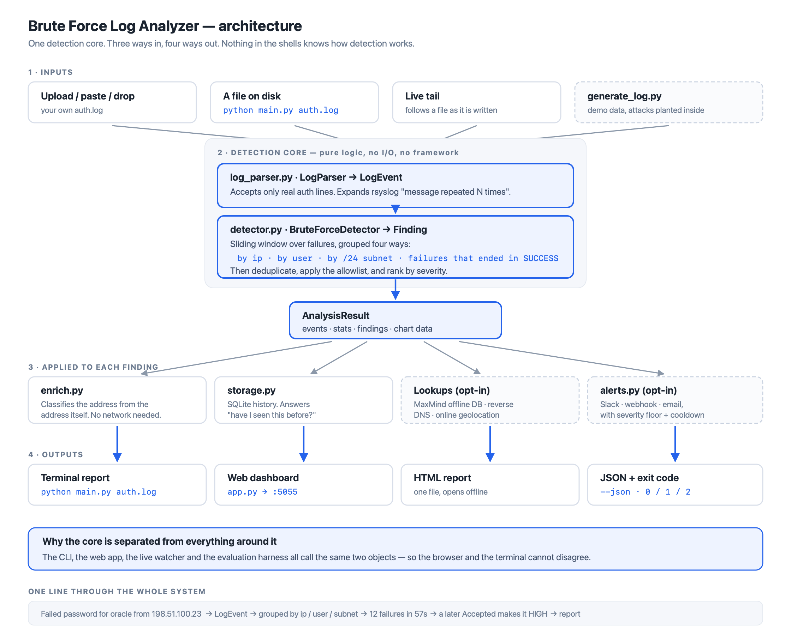

# How to use this project

A tool that reads SSH authentication logs and finds password-guessing attacks —
including the ones that simple failure-counting misses.



---

## Setup — once

```bash
cd "BruteForce Project/brute_force_log_analyzer"
python3 -m venv .venv
source .venv/bin/activate            # Windows: .venv\Scripts\activate
pip install -r requirements.txt
```

Keep the quotes around the path — `BruteForce Project` contains a space.

Check it works:

```bash
./selfcheck.sh
```

61 checks across every layer. Each prints ✓ or ✗, so a failure tells you
*which* part broke. Exits `0` only if all pass.

---

## The two files to try first

They sit in this folder, named so you know which is which:

| File | What it contains |
|---|---|
| `EXAMPLE-1-attacks-present.log` | A day under attack — 5 techniques, including one that **succeeds** |
| `EXAMPLE-2-no-attacks.log` | The same host on a quiet day — must find nothing |

```bash
python main.py EXAMPLE-1-attacks-present.log -t 4 -w 600
python main.py EXAMPLE-2-no-attacks.log      -t 4 -w 600
```

The first gives you 10 findings, one of them HIGH. The second gives you
nothing — and that is the harder half. It is full of real logins, mistyped
passwords, background scanning, cron and sudo noise. Staying quiet on all of
that is what separates a usable tool from an alarm nobody reads.

> **Both files are synthetic.** They were written by `make_logs.py` for
> demonstration, using only addresses from ranges reserved for documentation
> (RFC 5737, RFC 2544, RFC 1918). Nothing was captured from a real host. If
> someone asks where the logs came from, that is the answer — and the tool
> behaves identically on a real `auth.log` you supply.

---

## Using it on your own log

This is what the tool is for. The samples exist so you do not have to wait to
be attacked before you can see it work.

```bash
# Linux
python main.py /var/log/auth.log          # Debian, Ubuntu
python main.py /var/log/secure            # RHEL, Fedora

# macOS keeps no plain-text sshd log, so export one first
log show --predicate 'process == "sshd"' --last 24h > ~/auth.log
python main.py ~/auth.log
```

Or drag the file onto the **Analyse** tab in the web app. Nothing is uploaded
anywhere — the analysis runs inside the process you started.

---

## The web app

```bash
PORT=5055 python app.py
```

Open **http://127.0.0.1:5055**

> Port 5000 is taken by AirPlay Receiver on macOS. Use 5055, or turn AirPlay
> off in System Settings → General → AirDrop & Handoff.

Five tabs:

### Analyse
Your log goes in the top box — drop a file, choose one, or paste. Demo data is
collapsed underneath it.

Then the sliders:

| Control | What it does |
|---|---|
| **Failure threshold** | How many failures before an alert fires |
| **Time window** | How close together those failures must be |
| **Compromise sensitivity** | Failures before a success that count as a breach |
| **Never alert on** | Your own networks — `10.0.0.0/8`, `192.168.0.0/16` |

Results re-compute on every change, so you can watch an attack appear and
disappear as you tune.

**Generate report** builds a standalone HTML page: verdict, findings with
evidence, timeline, busiest sources, method, and limitations. One file, no
external assets — it opens offline and prints to PDF.

### IP lookup
Type an address, choose which sources to ask:

| Method | Network? | Leaves your machine? |
|---|---|---|
| Built in | no | no |
| MaxMind GeoLite2 | no | no |
| Reverse DNS | yes | no |
| Online geolocation | yes | **yes** |

The online one is off unless you tick it, and refuses to send private or
documentation addresses at all. Findings on the Analyse tab have a **look up**
button that jumps here with the address filled in.

### Live monitor
Follows a log file as it is written and reports attacks as they happen.

```bash
# terminal 2 — writes attack lines over ~30 seconds so you can watch
./simulate_attack.sh
```

Point the tab at `/tmp/demo_auth.log`, threshold 4, window 600, press
**Start**, then run the script. Nothing fires on the first three failures; the
fourth crosses the threshold and appears immediately. It survives log rotation.

### History
Every analysis is recorded to SQLite, so it can answer *"have I seen this
address before?"* — the question a one-shot tool cannot. **Clear history**
wipes it.

### Setup
What is actually configured, read live from the running process. Anything
unconfigured says so and names the setting that switches it on.

---

## Command line

```bash
python main.py                                   # defaults to auth_sample.log
python main.py mylog.log -t 4 -w 600             # tune it
python main.py mylog.log --json                  # machine-readable
python main.py --help
```

Exit codes, so it can drive a cron job:

| Code | Meaning |
|---|---|
| `0` | No findings |
| `1` | At least one finding |
| `2` | Could not run |

```bash
python main.py /var/log/auth.log || notify-send "SSH attack detected"
```

---

## What each file does

| File | Role |
|---|---|
| `log_parser.py` | Log syntax → `LogEvent`. Knows nothing about attacks |
| `detector.py` | The detection. Knows nothing about files or HTTP |
| `main.py` | Command-line shell |
| `app.py` | Web shell + JSON API |
| `report.py` | Builds the HTML report |
| `enrich.py` | What is known about an address |
| `storage.py` | SQLite history |
| `alerts.py` | Slack / webhook / email |
| `watcher.py` | Live tail |
| `generate_log.py`, `make_logs.py` | Demo data |
| `evaluate.py` | Scores the detector against labelled attacks |
| `selfcheck.sh`, `demo.sh` | Proof it works |

The two files at the top are the whole product. Everything else is a shell
around them or a way of checking them, which is why the browser and the
terminal can never disagree.

---

## Optional extras

Nothing below is on until you supply a value. Copy `.env.example` to `.env`.

| Feature | Setting | Where to get it |
|---|---|---|
| Live monitoring default | `BFLA_WATCH_PATH` | Your log file path |
| Slack alerts | `BFLA_SLACK_WEBHOOK_URL` | Slack app → Incoming Webhooks |
| Webhook alerts | `BFLA_WEBHOOK_URL` | Any endpoint taking JSON |
| Email alerts | `BFLA_SMTP_HOST`, `BFLA_MAIL_FROM`, `BFLA_MAIL_TO` | Your mail server |
| Country + operator | `BFLA_GEOIP_CITY_DB`, `BFLA_GEOIP_ASN_DB` | Free GeoLite2 files, maxmind.com |
| Never alert on | `BFLA_ALLOWLIST` | Your own ranges |

Without a GeoIP database addresses are still classified — private,
documentation, public — from the address itself. **No location is invented.**

---

## Docker

```bash
docker compose up --build
```

Runs as a non-root user behind gunicorn with a healthcheck. History persists
in a volume.

---

## What it will not do

Stated plainly, because knowing where a detector breaks matters as much as
knowing what it catches.

- **An attacker slower than your window is invisible.** `logs/attacks/03-low-and-slow.log`
  produces nothing at 4/600; it needs a 1800-second window. Only the
  compromise check would catch such an attacker, and only if they succeed.
- **Syslog carries no year.** A log spanning 31 December to 1 January produces
  a negative interval and the attack is missed.
- **Leap years.** 29 February and 1 March collapse to the same day.
- **IPv4 only** for subnet grouping.
- **The whole log is held in memory.** Fine for the 5 MB web cap; a
  multi-gigabyte log needs streaming.
- **It reports, it does not block.** `fail2ban` is the tool that blocks.
- **Synthetic validation only.** The generated corpus is a much better test
  than hand-written samples and still is not real attack traffic.

---

## Checking everything still works

```bash
./selfcheck.sh                       # 61 checks, ~20s
python -m unittest discover          # 329 tests
python evaluate.py --realistic       # the tuning sweep
./demo.sh                            # guided tour
```

One finding worth knowing: on the small hand-written samples a threshold of 3
scores perfectly. On five generated days of realistic traffic it raises **80
false alarms a day**, because ordinary background scanning accumulates past
three. The measured operating point is **4 failures in 600 seconds**, and it
took generating realistic traffic to find that out.
